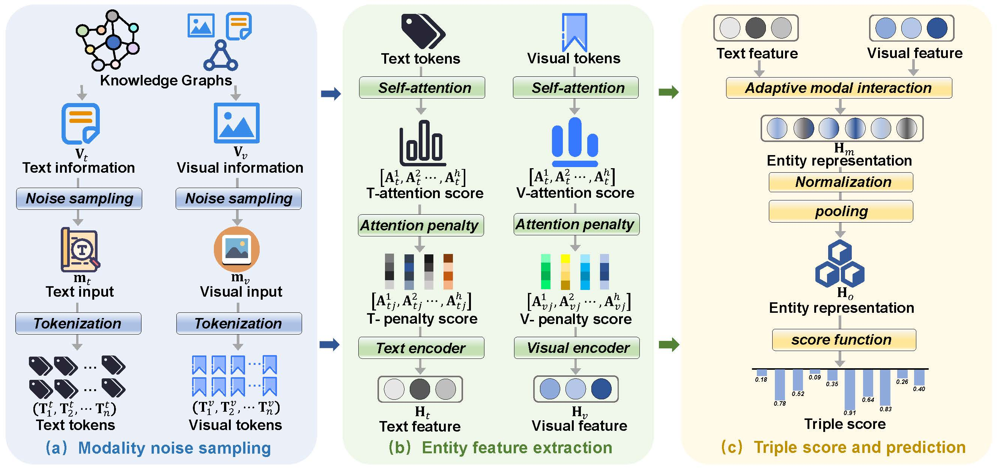

# APKGC: Noise-enhanced Multi-Modal Knowledge Graph Completion with Attention Penalty

## Overview

<p align="center">
  
</p>

## Environment

pip install -r requirements.txt

## Data

The datasets consist of DB15K and MKG-W, each containing a combination of structural, textual, and image information. Here, we directly present their embeddings. You can download all the datasets from [Google Drive](https://drive.google.com/drive/folders/1wGvlzt0i6RYcMniwooFcLKVEs2NBMcpB?usp=drive_link
). Then put them in the 'embeddings' folder.

## Run
bash run.sh

```bash
EMB_DIM=128
NUM_BATCH=2048
MARGIN=12
LR=1e-4
LRG=1e-4
NEG_NUM=64
EPOCH=8000
NOISE=1
POOL=1
```
## Citation

```
@inproceedings{APKGC,
   author = {Jian, Yue and Luo, Xiangyu and Li, Zhifei and Zhang, Miao and Zhang, Yan and Xiao, Kui and Hou, Xiaoju},
   title = {APKGC: Noise-enhanced Multi-Modal Knowledge Graph Completion with Attention Penalty},
   booktitle = {Proceedings of the AAAI Conference on Artificial Intelligence},
   pages = {15005-15013},
   year = {2025}
}
```
